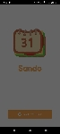
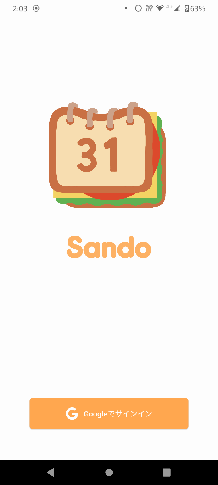
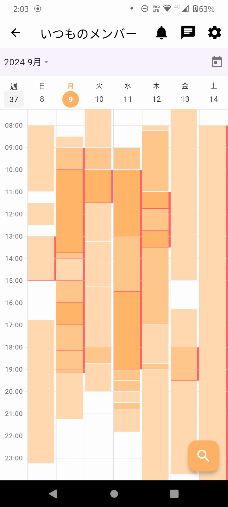
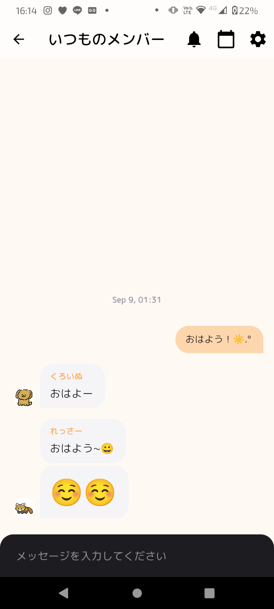
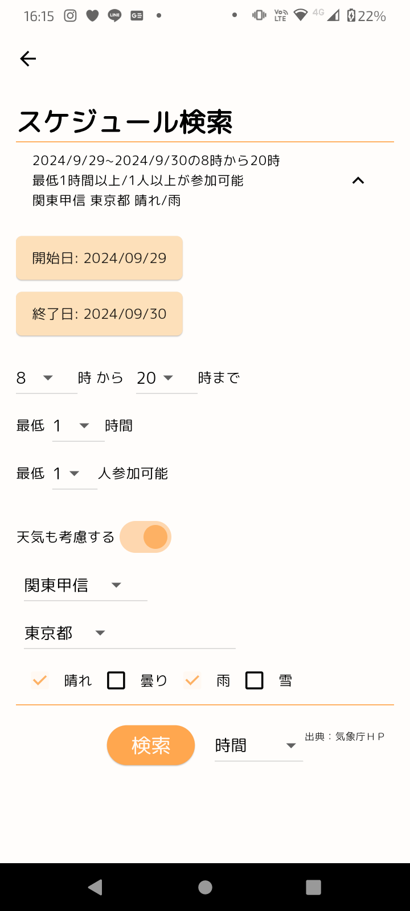
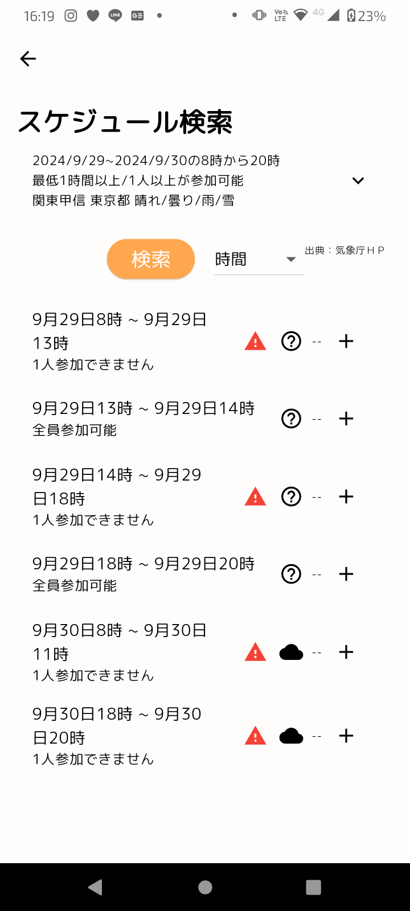
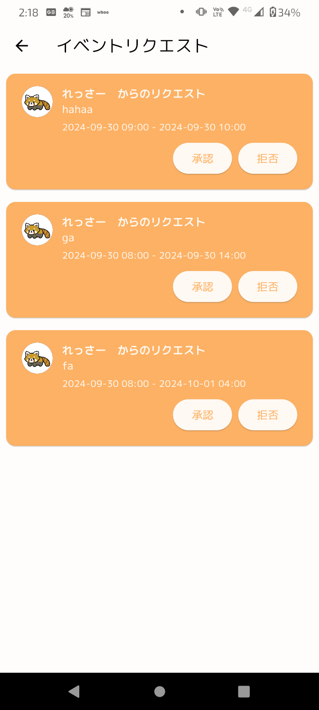
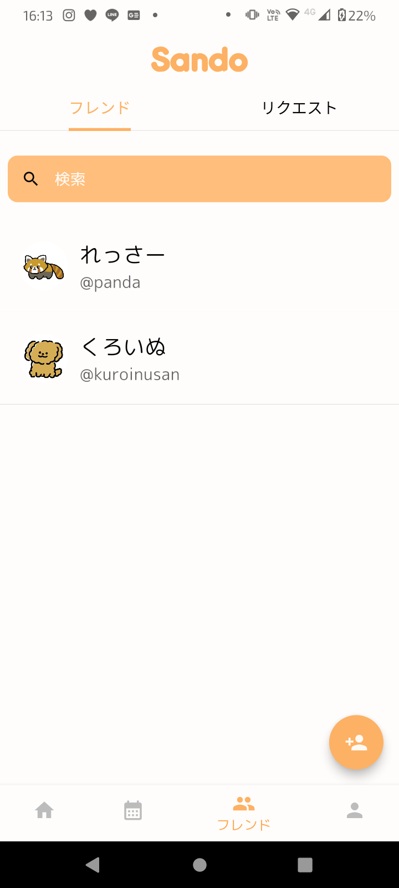
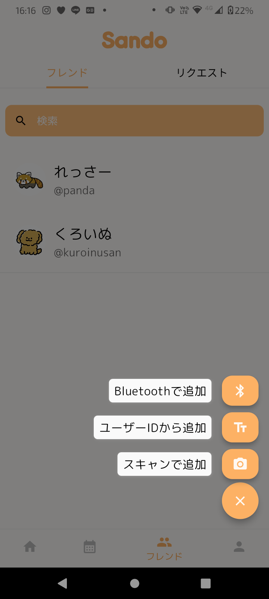
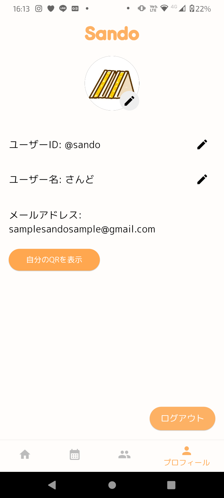

  
  

  
<b>ソーシャルカレンダー & スケジュール自動調整アプリ</b>

  

    
    
    
    
    
  

  

    
    &nbsp;&nbsp;
    
  

  

 

## 🇯🇵 日本語 (Japanese)

### 💡 アプリ概要
友だちと遊ぶ予定を立てるとき、お互いの空いている日を確認するのは非常に面倒です。「Sando」はそのような手間を解決する、スケジュール調整特化型のカレンダーアプリです。

Googleアカウントでログインするだけで、既存のGoogleカレンダーと連携。プライバシーを守りながら、スムーズに予定を調整できます。

**🏆 実績:** アプリ甲子園にて、**応募総数3,000作品の中からTOP24**に選出されました。

### ✨ 主な機能

1.  **Google Calendarとのシームレスな連携**
    * ログインするだけで自動同期。手動で予定を移す必要はありません。
2.  **プライバシーを保った共有**
    * 「予定がある」という事実のみを共有し、内容（「デート」「病院」など）は伏せられます。
3.  **高度なスケジュール検索機能**
    * 「日付範囲」「時間帯」「天気」「参加人数」を指定すると、最適な日時を自動提案します。
4.  **選択的なカレンダー共有**
    * 仕事用、プライベート用など、相手に合わせて共有するカレンダー（コンテンツ）を使い分けられます。
5.  **アプリ内チャット**
    * 日程調整の相談から決定まで、アプリ内で完結します。

### 🎥 デモ動画

  
   
  <i>クリックでデモ動画を再生</i>

 

### 📸 スクリーンショット

  
<b>クリックしてアプリ画面を見る（9枚）</b>

   
  

    <table>
      <tr>
        <td><b>ログイン画面</b> </td>
        <td><b>カレンダー表示</b> </td>
        <td><b>グループチャット</b> </td>
      </tr>
      <tr>
        <td><b>条件検索</b> </td>
        <td><b>検索結果</b> </td>
        <td><b>追加リクエスト</b> </td>
      </tr>
      <tr>
        <td><b>フレンド管理</b> </td>
        <td><b>フレンド追加</b> </td>
        <td><b>プロフィール</b> </td>
      </tr>
    </table>
  

### 💻 技術スタック・開発環境

| カテゴリ | 詳細 |
| :--- | :--- |
| **📱 フレームワーク** | Flutter (Dart) |
| **🛠 開発ツール** | Android Studio, VS Code, GitHub |
| **⚙️ 実行環境** | CORESERVER V2 CORE-X |
| **🐘 バックエンド** | PHP 7.4.33 |
| **🗄 データベース** | MySQL |
| **☁️ API・外部データ** | Google OAuth 2.0, Google Calendar API, 気象庁 |

> **💡 特記事項**
> **Google Calendar APIのPush Notifications**を使用し、カレンダーおよび予定情報をデータベースにリアルタイムで自動同期する仕組みを実装しています。

---

  
制作者: <b>真鍋 将彰</b>・<b>内田 侑希</b>・<b>鈴木 慎志</b>

